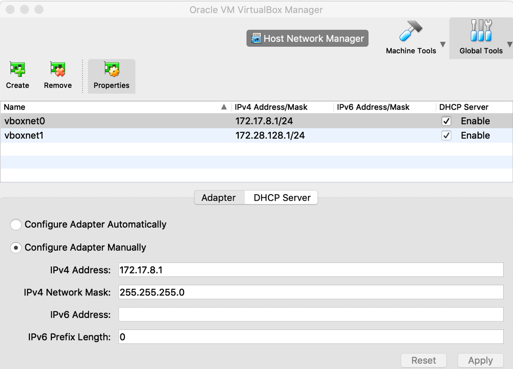

# kubernetes-cluster-vagrant

This creates a kubernetes cluster using vagrant. Nodes are based on Ubuntu 18.04, kubernetes version is latest.
1. first running Copy Vagrant-master to a folder and running:
vagrant up
2. create calico networking stuffs:
kubectl create -f ./rbac-kdd.yaml
kubectl create -f ./calico.yaml

3. Copy Vagrant-second-node to a folder and run:
vagrant up

4. output
```
robert@imac:~/src/vagrant-cluster-calico$ k get nodes
NAME               STATUS   ROLES    AGE     VERSION
kcluster-calico    Ready    master   6h33m   v1.13.3
kcluster-calico2   Ready    <none>   73m     v1.13.3
robert@imac:~/src/vagrant-cluster-calico$ kubectl get pods -n kube-system -owide
NAME                                      READY   STATUS    RESTARTS   AGE     IP            NODE               NOMINATED NODE   READINESS GATES
calico-node-28942                         2/2     Running   0          59m     10.0.2.15     kcluster-calico    <none>           <none>
calico-node-m78p2                         2/2     Running   0          59m     10.0.2.15     kcluster-calico2   <none>           <none>
coredns-86c58d9df4-j5xs6                  1/1     Running   0          6h33m   192.168.0.3   kcluster-calico    <none>           <none>
coredns-86c58d9df4-zhfkl                  1/1     Running   0          6h33m   192.168.0.2   kcluster-calico    <none>           <none>
etcd-kcluster-calico                      1/1     Running   0          6h32m   10.0.2.15     kcluster-calico    <none>           <none>
kube-apiserver-kcluster-calico            1/1     Running   0          6h32m   10.0.2.15     kcluster-calico    <none>           <none>
kube-controller-manager-kcluster-calico   1/1     Running   0          6h32m   10.0.2.15     kcluster-calico    <none>           <none>
kube-proxy-gq849                          1/1     Running   0          6h33m   10.0.2.15     kcluster-calico    <none>           <none>
kube-proxy-qnzvc                          1/1     Running   0          73m     10.0.2.15     kcluster-calico2   <none>           <none>
kube-scheduler-kcluster-calico            1/1     Running   0          6h32m   10.0.2.15     kcluster-calico    <none>           <none>
```

5. issues and solutions
* the vms in virtualbox on MAC (NAT) always has the 10.0.2.15 and kubernetes set this as the api listening address, solution is set and IP on vagrant provisioning script and set apiserver-advertise-address to this IP address.
We defined the master as 172.17.8.211, second node as 172.17.8.212.


      


# reference:
https://gist.github.com/lizrice/69d3b28979391287176b3b7155a327b9

https://www.objectif-libre.com/en/blog/2018/07/05/k8s-network-solutions-comparison/

